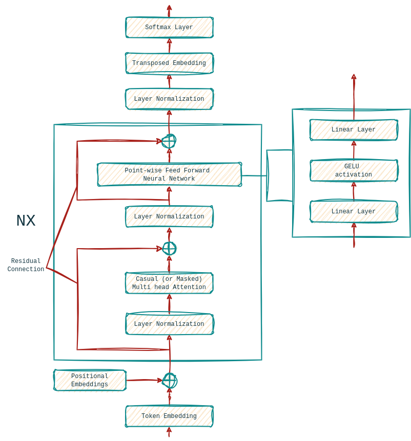

## Build GPT
This repo follows Andrej Karpathy's [build-nanogpt](https://github.com/karpathy/build-nanogpt). 

### GPT-2

Fig. GPT architecture

GPT-2 (Generative Pretrained Transformer 2) is a state-of-the-art language model created by OpenAI. It uses transformer-based architecture and is capable of generating human-like text based on the input provided. With 1.5 billion parameters, GPT-2 can perform a wide range of tasks like text generation, summarization, and translation without needing task-specific training data.

### Papers
✅ [Language Models are Unsupervised Multitask Learners](https://cdn.openai.com/better-language-models/language_models_are_unsupervised_multitask_learners.pdf)  
☑️  [Language Models are Few-Shot Learners](https://arxiv.org/pdf/2005.14165)  
✅ [Attention is All You Need](https://arxiv.org/abs/1706.03762)  
☑️  [Gaussian Error Linear Units (GELUs)](https://arxiv.org/abs/1606.08415)  
☑️  [HellaSwag: Can a Machine Really Finish Your Sentence?](https://arxiv.org/abs/1905.07830)  

### References
🌐 [nanoGPT](https://github.com/karpathy/nanoGPT) - Implementation by Andrej Karpathy.  
🌐 [build-nanogpt](https://github.com/karpathy/build-nanogpt) - Implementation by Andrej Karpathy.    
🌐 [gpt-2](https://github.com/openai/gpt-2) - TensorFlow implementation of GPT-2 by OpenAI.  
🌐 [modeling-gpt2](https://github.com/huggingface/transformers/blob/main/src/transformers/models/gpt2/modeling_gpt2.py) - PyTorch implementation of GPT-2 by HuggingFace.  